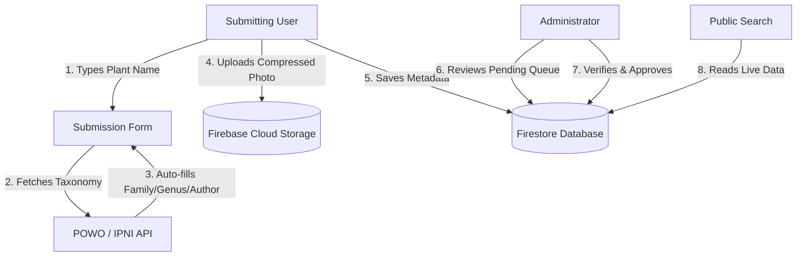

# Implementation Plan: Dynamic Submission, POWO Taxonomy Autocomplete, & Admin Verification System

This plan outlines the design and integration of a serverless database backend (Google Firebase), dynamic client-side image compression, and automatic taxonomic resolution (fetching Families, Genera, and Species details dynamically from Kew's Plants of the World Online - POWO / IPNI).

---

## Technical Architecture Overview



---

## Kew's POWO / IPNI Taxonomy API Integration

To prevent spelling mistakes and ensure standardized nomenclature, the submission form will integrate a real-time botanical lookup. When a contributor begins typing a species or genus, the system queries Kew's Plants of the World Online (POWO) index.

### 1. API Endpoint Details
*   **Search Endpoint:** `https://api.ipni.org/v1/search?q={query}` (IPNI/POWO index) or Kew's POWO API: `https://www.plantsoftheworldonline.org/api/2/search?q={query}`
*   **Response Attributes Parsed:**
    *   `name`: Full botanical name (e.g., *Scutellaria wightiana*).
    *   `author`: Scientific author citation (e.g., *Benth.*).
    *   `family`: Plant Family (e.g., *Lamiaceae*).
    *   `genus`: Extracted genus (e.g., *Scutellaria*).
    *   `fqId` / `powoId`: Kew database identifier for reference.

### 2. Auto-fill Workflow in Form
1.  **Species/Name Field Lookup:** The user types in the "Botanical Name" input.
2.  **Debounced Lookup:** Once 3 letters are typed, a debounced fetch request calls the POWO API.
3.  **Dropdown Selector:** The form shows suggestions of matched valid botanical names.
4.  **Auto-fill Action:** When the user selects a botanical name:
    *   The **Species/Name** field sets to the clean botanical name (e.g., `Scutellaria wightiana`).
    *   The **Family** field auto-fills and locks (e.g., `Lamiaceae`).
    *   The **Author** field auto-fills (e.g., `Benth.`).
    *   A badge links to the POWO database profile for reference.

---

## Key System Components

### 1. Role-Based Authentication (`Firebase Auth`)
*   **Public Contributor:** Registers via email/Google. Can submit specimens and view their history.
*   **Admin Team:** Multiple administrators. Accesses the `/admin` console to review, modify, approve, or reject submissions.

### 2. Database (`Firebase Firestore`)
Metadata schema in Firestore:
*   **`specimens` Collection:**
    *   `barcode`: String (e.g. `GVCH004859`)
    *   `name`: String (Botanical Name)
    *   `family`: String
    *   `author`: String
    *   `powoId`: String (Kew reference ID)
    *   `place`, `district`, `state`: Strings
    *   `collectedBy`: String
    *   `date`: Timestamp
    *   `photoURL`: String (Firebase Storage link)
    *   `verify`: Boolean (default `false`, set to `true` by Admin)
    *   `submittedBy`: UID (Submitting User)
    *   `createdAt`: Timestamp

### 3. Client-Side Image Compression
Before uploading, the browser downsamples high-resolution smartphone images using HTML5 Canvas:
*   **Dimensions:** Max width/height of 1600px (standard portrait size).
*   **Output Format:** converted to **WebP** for 80% reduction in size with zero visible detail loss.
*   **Target Size:** Max file size around **~200 KB**.

---

## Step-by-Step Implementation Roadmap

### Phase 1: Firebase Project & Auth Config
*   Configure the Firebase CLI project.
*   Deploy Firestore security rules requiring `auth != null` to submit, and `users[uid].role == 'admin'` to approve.

### Phase 2: POWO Lookup & Compression Submission Form
*   Integrate a debounced POWO fetch script:
    ```javascript
    let debounceTimer;
    inputName.addEventListener('input', () => {
        clearTimeout(debounceTimer);
        const query = inputName.value.trim();
        if (query.length < 3) return;
        
        debounceTimer = setTimeout(() => {
            fetch(`https://www.plantsoftheworldonline.org/api/2/search?q=${encodeURIComponent(query)}`)
                .then(res => res.json())
                .then(data => showPowoSuggestions(data.results))
                .catch(err => console.error("POWO fetch failed", err));
        }, 300);
    });
    ```
*   Implement Canvas image compression converter.

### Phase 3: Admin Approval Dashboard
*   Build a secure review queue page.
*   Display a comparison layout: user submission metadata side-by-side with verified POWO taxonomy records to help admins quickly fix typos.

### Phase 4: Migration
*   Export existing `data.js` entries into Firestore.
